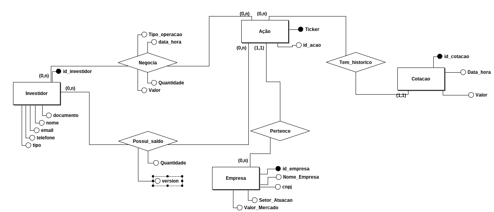
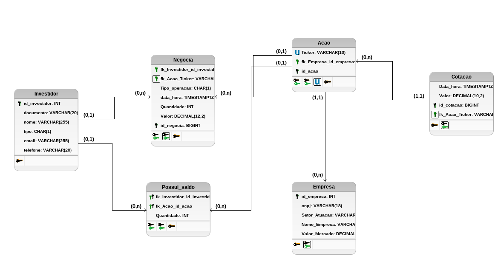

**Aluno:** Cristiano da Silva Lemes
**Matricula:** 252.100.246
**Curso:** GenAi e LLMs Master

## TDP-2025.2 – Atividade Avaliativa
### Implementar o modelo conceitual, lógico e físico do Case Negociação de Bolsa de Valores

Case – Negociações na Bolsa de Valores Uma corretora deseja criar um sistema para gerenciar Investidores, Ações e suas Negociações na bolsa de valores. Cada Investidor deve ser identificado por um CPF ou CNPJ, além de possuir nome completo, tipo de investidor (pessoa física ou jurídica), e-mail e telefone. Já cada Ação pertence a uma Empresa listada na bolsa, identificada por seu ticker (código de negociação), além de atributos como nome da empresa, setor de atuação e valor de mercado. Os investidores podem realizar diversas Negociações (compra ou venda de ações). Para cada negociação, é necessário registrar data e hora da transação, tipo de operação (compra ou venda), quantidade de ações e valor unitário no momento da negociação. Como um mesmo investidor pode negociar várias ações diferentes ao longo do tempo, e uma ação pode ser negociada por vários investidores, esse relacionamento precisa ser bem estruturado. Além das negociações, a corretora deseja manter o Histórico de Cotações das Ações, pois o preço de uma ação varia constantemente ao longo do dia. Esse histórico deve armazenar data, hora e valor da cotação para cada ação em determinado momento, permitindo análises de séries temporais e estudos de comportamento do mercado. Por fim, a corretora deseja acompanhar o Saldo de Carteira de cada investidor, que representa a posição atual (quantidade de ações mantidas). Esse saldo deve ser atualizado a partir das negociações realizadas, mas o sistema também deve permitir análises retrospectivas usando o histórico de cotações.

## Entregas

**Atividades**

- Modelo Conceitual no BR Modelo (incluir arquivo e print);
- Modelo lógico textual ou gráfico (incluir arquivo e print);
- Modelo físico (incluir arquivo .SQL com as DDLs, DMLs e DQLs).

**Entrega**

- A entrega deverá será feita via Classroom;
- A atividade poderá ser feita em equipes de até 10 alunos.
- Como sugestão, criar um arquivo Word com os resultados do conceitual e lógico, e anexar o arquivo .SQL a parte.

**Data de entrega**
- O trabalho deverá ser entregue até 01/12;
- Entre em contato caso precise de mais tempo para a conclusão da atividade.

### Modelo Conceitual 

#### 1. Gestão de Investidores

Para o item "gerenciar Investidores identificados por CPF ou CNPJ..." do case, foi criada a entidade Investidor, porque era necessário centralizar os dados cadastrais (documento, nome, contato) da pessoa física ou jurídica que atua no sistema, servindo como ponto de partida para todas as operações.

#### 2. Estrutura de Ativos (Ação vs. Empresa)

Para o item "cada Ação pertence a uma Empresa... identificada por seu ticker... além de atributos como nome da empresa e setor", foram criadas as entidades Ação e Empresa de forma separada, ligadas pelo relacionamento Pertence, porque isso respeita a normalização de dados: evita-se repetir as informações da empresa (CNPJ, Setor) para cada ticker diferente que ela possa emitir na bolsa.

#### 3. Registro de Transações

Para o item "realizar diversas Negociações (compra ou venda)... registrando data, hora, quantidade e valor", foi criado o relacionamento N:N Negocia contendo esses atributos, porque uma negociação não é um dado estático, mas sim um evento que vincula um Investidor específico a uma Ação específica em um determinado momento.

#### 4. Monitoramento de Mercado

Para o item "manter o Histórico de Cotações... armazenar data, hora e valor para cada ação", foi criada a entidade Cotacao ligada à Ação, porque estes são dados de séries temporais que dependem exclusivamente do ativo (Ticker), independentemente de haver investidores comprando ou vendendo naquele momento.

#### 5. Controle de Posição

Para o item "acompanhar o Saldo de Carteira... que representa a posição atual", foi criado o relacionamento Possui_saldo com o atributo Quantidade, porque o sistema precisa diferenciar o histórico de movimentações (log de transações) do estado atual da carteira (snapshot), permitindo consultas rápidas sobre quantas ações o investidor detém no momento sem precisar recalcular todo o histórico.

## Modelo lógico

#### 1. Estratégia de Chaves Primárias (PK) e Estrangeiras (FK)

**A. Uso de IDs Numéricos**

**Tabelas:** `Investidor`, `Empresa`, `Negocia`, `Cotacao`, `id_acao`
- **Escolha:** Campos `id_...` do tipo `INT` ou `BIGINT` com _Auto Increment_.
- **Por que:**
    - **Desempenho:** Bancos de dados indexam números inteiros muito mais rápido do que textos.    
    - **Independência:** Se a empresa mudar de CNPJ (fusão) ou o investidor mudar de nome, o ID interno permanece o mesmo, mantendo a integridade dos relacionamentos.
    - **Volume:** Para `Negocia` e `Cotacao`, foi usado `BIGINT` porque o volume de registros pode ultrapassar o limite do `INT` (2 bilhões) rapidamente.

**B. Chave Composta**

**Tabela:** `Possui_saldo`
- **Escolha:** Combinação de `fk_Investidor` + `fk_Acao`.
- **Por que:** A regra de negócio diz que um investidor só pode ter **um** registro de saldo para cada ativo. Definir essa combinação como PK impede duplicidade física no banco (o sistema rejeitaria dois registros de saldo de PETR4 para a mesma pessoa).
 
#### 2. Escolha dos Tipos de Campos

**A. Campos Monetários (`DECIMAL` vs `FLOAT`)**
**Campos:** `Valor`, `Valor_Mercado`
- **Tipo Escolhido:** `DECIMAL(18, 2)`.
- **Por que:** **Esta é a decisão mais crítica.** Tipos como `FLOAT` ou `DOUBLE` usam aproximação binária e perdem precisão (ex: podem gravar 10.00 como 9.99999998). O `DECIMAL` armazena o número exato, o que é obrigatório para sistemas financeiros para evitar "desaparecimento" de centavos em somatórios.

**B. Campos de Identificação (`VARCHAR` vs `INT`)**
**Campos:** `cpf`, `cnpj`, `telefone`
- **Tipo Escolhido:** `VARCHAR`.
- **Por que:** Embora sejam números, eles não são usados para cálculos matemáticos.
    - **Zeros à Esquerda:** Um CPF `012...` seria gravado como `12...` se fosse numérico, perdendo o zero.
    - **Formatação:** O `VARCHAR` permite flexibilidade caso se decida salvar pontuação (embora o ideal seja salvar limpo).
**C. Campos de Texto (`VARCHAR` vs `CHAR`)**

**Campos:** `nome`, `email` vs. `tipo`, `uf`, `Ticker`
- **Variavel (`VARCHAR`):** Usado para `nome` e `email` porque o tamanho varia muito. O banco só ocupa o espaço necessário. O `Ticker`foi usado para `VARCHAR` curto (10 caracteres) poderia ser `CHAR` se houver padronização rígida nos nomes de ações.
- **Fixo (`CHAR`):** Recomendado para `tipo` ('F'/'J') ou `UF` ('SP'). Como o tamanho é sempre igual, o `CHAR` é levemente mais rápido para buscar. 

**D. Campos Temporais**
**Campos:** `data_hora`
- **Tipo Escolhido:** `TIMESTAMPTZ`.
- **Por que:** O mercado financeiro é global. Uma transação registrada como "10:00" é ambígua. É 10:00 em São Paulo ou em Nova York? A falta de informação de fuso horário pode levar a erros graves em análises de arbitragem e relatórios fiscais.

### Modelo fisico

O modelo físico materializa as regras de negócio definidas nas etapas anteriores em estruturas de armazenamento otimizadas para um Sistema Gerenciador de Banco de Dados (SGBD) relacional. As principais decisões de implementação foram:

**1. Precisão Financeira (Tipagem Crítica)**

Para garantir a exatidão dos cálculos monetários, todos os campos de valor (Valor, Valor_Mercado) foram definidos como DECIMAL (ou NUMERIC).
- **Por que:** Evita-se o uso de ponto flutuante (`FLOAT`), que causa erros de arredondamento em operações financeiras. O formato `DECIMAL(18,2)` permite armazenar valores na casa dos quatrilhões com precisão absoluta de centavos.

**2. Escalabilidade e Volumetria**
As tabelas transacionais de alto volume (Negocia e Cotacao) utilizam chaves primárias do tipo BIGINT.
- **Por que:** Diferente do `INT` comum (limitado a ~2 bilhões), o `BIGINT` suporta quintilhões de registros, garantindo que o histórico de preços e transações possa crescer indefinidamente sem estourar a capacidade do identificador.
    
**3. Estratégia de Indexação e Chaves**
- **Chaves Artificiais (Surrogate):** Entidades como `Investidor`, `Empresa`  e `Acao`utilizam IDs numéricos sequenciais para garantir estabilidade referencial, mesmo se documentos ou nomes mudarem. Se o `Ticker` for a Chave Primária, ele será referenciado como Chave Estrangeira (Foreign Key - FK) em milhões de registros nas tabelas `Negocia`, `Cotacao` e `Possui_saldo`. Para alterar `VVAR3` para `VIIA3`, o banco de dados precisaria realizar um `UPDATE CASCADE` em todas essas tabelas. Em um banco com bilhões de cotações, essa operação bloquearia as tabelas (Table Lock) por horas, causando indisponibilidade do sistema.
- **Chave Composta:** A tabela `Possui_saldo` utiliza uma chave primária composta (`id_investidor` + `id_acao`) para impedir fisicamente a duplicidade de registros de saldo para um mesmo ativo.

**4. Integridade Referencial**
- Foram aplicadas restrições de Foreign Key (FK) rigorosas com cláusulas NOT NULL em relacionamentos obrigatórios, para garantir a consistência dos dados, impedindo, por exemplo, a criação de uma cotação sem ação vinculada ou uma negociação sem investidor. O banco rejeitará qualquer operação que viole essas regras.
- Adicionado `CHECK CONSTRAINT` na tabela Investidor para validar o tamanho do documento (CPF/CNPJ) conforme o Tipo, limitar os tipos para F ou J (Pessoa física ou juridica).
-  Adicionado o campo `version` na tabela de Saldo para implementar _Optimistic Locking_.

**5. Otimização de Leitura vs. Escrita**

- A separação física entre o log de transações (Negocia) e o snapshot de posição (Possui_saldo) foi consolidada.
- Permite que o sistema registre milhões de operações históricas enquanto mantém uma tabela leve e rápida apenas para consultar o saldo atual do investidor, otimizando a performance do "Home Broker".

**6. Auditoria:**
- Criação de uma tabela de Log para rastrear alterações críticas.

### Anexos

**Arquivos BR MODELO**
Conceitual_1.brM3 
Lógico_1.brM3  

**Arquivos SQL

ddl.sql
dml.sql 
dql.sql